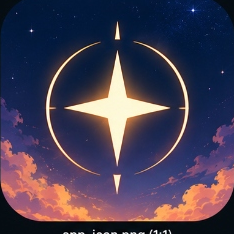
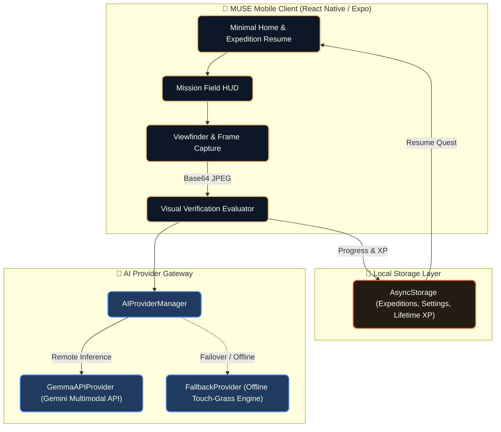
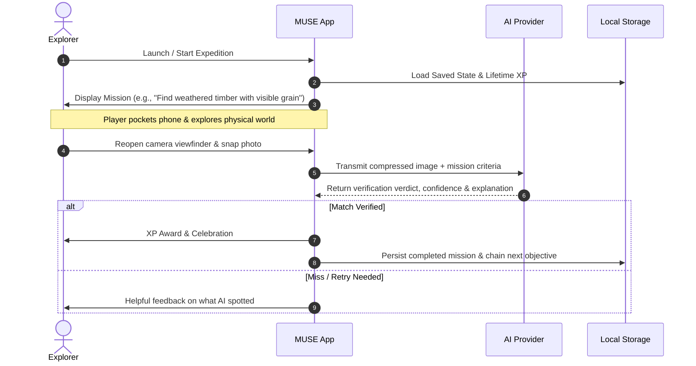

<div align="center">
  <br />
  
  <br />
  <br />
  <h1>✦ M U S E</h1>
  <p><strong>See the World Differently · Put Your Phone Away</strong></p>
  <p><i>Real-world sensory scavenger hunt & outdoor exploration mobile game powered by multimodal AI vision on React Native & Expo.</i></p>

  <br />

  <div>
    <a href="https://lazyshrey.com"></a>
    <a href="https://github.com/lazyshrey/muse"></a>
    <a href="https://discord.com/invite/ZVCB8EnRX2"></a>
    
    
    
    
    
    <a href="LICENSE"></a>
  </div>

  <br />

  <div align="center">
    <h3><a href="SCREENSHOTS.md">Explore the Visual Showcase (Screenshots & In-Game Captures)</a></h3>
  </div>

  <br />

  <p>
    <a href="#about-muse">About</a> •
    <a href="#core-philosophy">Philosophy</a> •
    <a href="#key-features">Features</a> •
    <a href="#system-architecture">Architecture</a> •
    <a href="#game-loop">Game Loop</a> •
    <a href="#mission-hierarchy">Missions</a> •
    <a href="#tech-stack">Tech Stack</a> •
    <a href="#quick-start">Quick Start</a> •
    <a href="#safety-directives">Safety</a> •
    <a href="#license">License</a>
  </p>
</div>

---

## About MUSE

**MUSE** is an inverted mobile application that uses artificial intelligence to get you **off your screen and into the real world**.

Unlike conventional AI apps designed to maximize indoor screen time and passive scrolling, MUSE issues contextual observation quests. Players receive an objective, put their phone into their pocket, wander physical spaces (parks, streets, campuses, hiking trails), spot hidden nuances in reality, and verify their findings by capturing a photo with the viewfinder.

> **"The AI interaction should be short; the real-world interaction should be long."**

<br />

<div align="center">
  <table border="0" cellspacing="0" cellpadding="16">
    <tr>
      <td width="300" valign="top" style="border: 1px solid #333; border-radius: 12px; background: rgba(255,255,255,0.03);">
        <h3>🌿 Touch Grass First</h3>
        <p>Quests require physical exploration, spatial awareness, and acute sensory observation of your immediate environment.</p>
      </td>
      <td width="300" valign="top" style="border: 1px solid #333; border-radius: 12px; background: rgba(255,255,255,0.03);">
        <h3>👁️ Multimodal AI Vision</h3>
        <p>Evaluates complex semantic criteria directly from camera frames via <b>Google Gemini & Gemma</b> vision APIs.</p>
      </td>
    </tr>
    <tr>
      <td width="300" valign="top" style="border: 1px solid #333; border-radius: 12px; background: rgba(255,255,255,0.03);">
        <h3>🔗 Procedural Quest Chaining</h3>
        <p>Every discovery fuels the next mission prompt, weaving an unbroken thematic trail across your adventure.</p>
      </td>
      <td width="300" valign="top" style="border: 1px solid #333; border-radius: 12px; background: rgba(255,255,255,0.03);">
        <h3>📴 Resilient Offline Fallback</h3>
        <p>Built-in heuristic edge simulations ensure full offline playability when exploring deep in the woods or off the grid.</p>
      </td>
    </tr>
    <tr>
      <td width="300" valign="top" style="border: 1px solid #333; border-radius: 12px; background: rgba(255,255,255,0.03);">
        <h3>💾 Persistent Expeditions</h3>
        <p>Saves active trails and accumulated lifetime XP locally via <code>AsyncStorage</code> so you never lose progress.</p>
      </td>
      <td width="300" valign="top" style="border: 1px solid #333; border-radius: 12px; background: rgba(255,255,255,0.03);">
        <h3>🌌 Minimal Field Aesthetic</h3>
        <p>Dark twilight atmosphere with golden hour amber accents, clean typography, and zero distracting clutter.</p>
      </td>
    </tr>
  </table>
</div>

<br />

---

## Core Philosophy

Most contemporary consumer software optimizes for retention metrics—demanding continuous gaze and fingertip interaction. 

**MUSE fundamentally reverses this equation:**
1. **Zero Chat Slop**: No speculative conversations or chat bubbles. The AI functions purely as an impartial referee and gamemaster.
2. **Physical Over Digital**: Every victory condition exists strictly outside your display.
3. **Serendipity & Mindfulness**: Notice architectural quirks, natural textures, light reflections, and urban curiosities that normally fade into background noise.

---

## System Architecture

MUSE separates device camera hardware, local session persistence, and multimodal model verification behind an interchangeable provider interface.



---

## Game Loop



---

## Mission Hierarchy

MUSE dynamically elevates challenges as your expedition unfolds:

| Tier | Category | Example Criteria | Reward |
| :--- | :--- | :--- | :---: |
| **Level 1** | **Sensory & Visual** | Geometric symmetry, distinct color contrasts, raw materials (moss, rusted steel, stone). | `+50 XP` |
| **Level 2** | **Functional Utility** | Objects designed for safety, guidance arrows, water distribution, physical barriers. | `+100 XP` |
| **Level 3** | **Abstract & Metaphoric** | Human craftsmanship mimicking nature, signs of chronological decay, dynamic shadows. | `+150 XP` |

---

## Tech Stack

<div align="center">
  <table>
    <tr>
      <th align="center">Domain</th>
      <th align="center">Stack & Libraries</th>
    </tr>
    <tr>
      <td><b>Mobile Framework</b></td>
      <td><code>React Native 0.86</code> • <code>Expo SDK 57</code> • <code>TypeScript 5.x</code></td>
    </tr>
    <tr>
      <td><b>Vision & AI</b></td>
      <td><code>Google Gemini 2.5 Flash / Gemma Multimodal Vision</code> • <code>Fast TFLite Edge Runtime</code></td>
    </tr>
    <tr>
      <td><b>Hardware & Camera</b></td>
      <td><code>expo-camera</code> • <code>expo-image-manipulator</code></td>
    </tr>
    <tr>
      <td><b>Persistence & State</b></td>
      <td><code>@react-native-async-storage/async-storage</code></td>
    </tr>
    <tr>
      <td><b>Design System</b></td>
      <td>Custom Minimal Twilight Field HUD • Makoto Shinkai Warm Palette</td>
    </tr>
  </table>
</div>

---

## Quick Start

### 1. Prerequisites
- **Node.js**: v18.x or later (Node 20+ recommended)
- **Package Manager**: `npm`, `pnpm`, or `bun`
- **Device**: Android (via USB ADB or Expo Go) or iOS (via Expo Go / Simulator)

### 2. Installation

```bash
# Clone the repository
git clone https://github.com/lazyshrey/muse.git
cd muse

# Install dependencies
npm install
```

### 3. Environment Configuration

To utilize live multimodal verification via Google AI Studio:

```bash
# Create an environment file
cp .env.example .env
```

Add your API key inside `.env`:
```env
EXPO_PUBLIC_GEMMA_API_KEY="your-google-ai-studio-api-key"
```

*(You can also configure or update your key in real time within the app's settings modal at `⚙ Settings`).*

### 4. Running the Application

```bash
# Start the Metro bundler
npx expo start

# Run directly on an attached Android device / emulator
npx expo run:android

# Run on iOS simulator
npx expo run:ios

# Run in web browser mode
npx expo start --web
```

### 5. Verification & Tests

```bash
# Run unit tests
npm test

# Run TypeScript type check
npm run typecheck
```

---

## Safety Directives

MUSE enforces algorithmic safety boundaries across all generated and curated missions:
- **No Trespassing**: Missions strictly target publicly accessible spaces. Never enter private property.
- **No Hazards**: Objectives never demand climbing dangerous heights, crossing traffic blindly, or confronting animals.
- **Privacy First**: Photos are captured solely for ephemeral AI verification. No personal imagery is indexed or broadcast.

---

## License

Distributed under the **MIT License**. See [`LICENSE`](LICENSE) for full details.

<div align="center">
  <sub>Engineered with care by <a href="https://github.com/lazyshrey">Shrey Jaiswal</a>.</sub>
</div>
