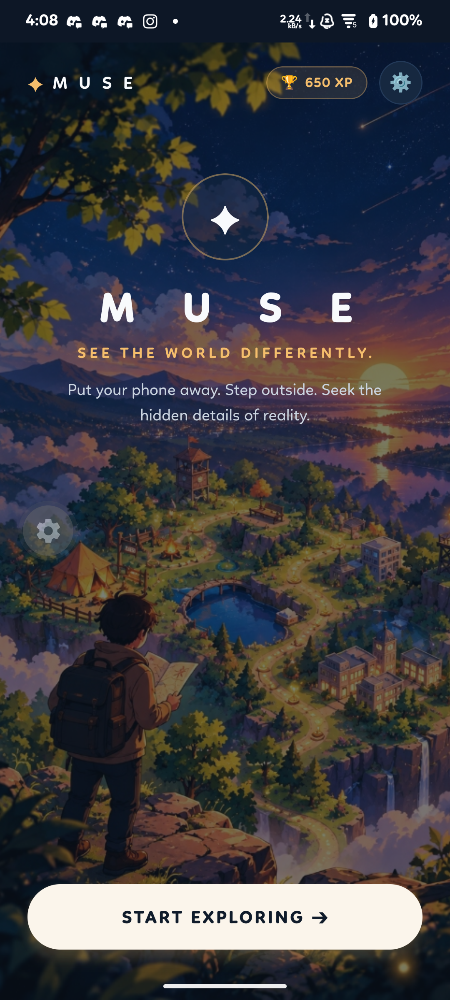
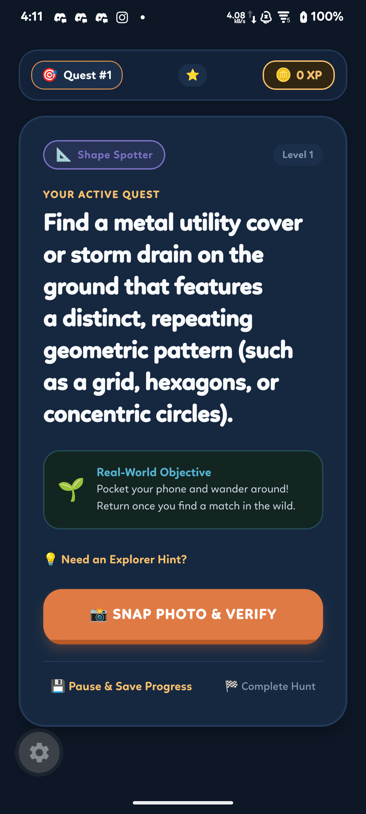
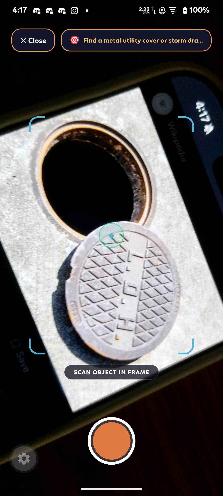
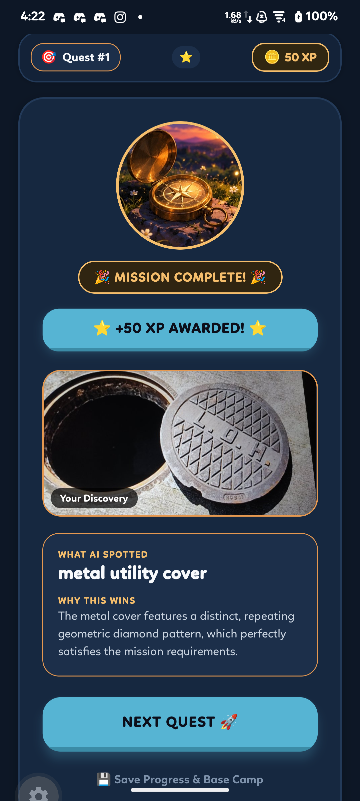

# MUSE — Visual Showcase

A high-definition visual walkthrough of the MUSE mobile experience across physical scavenger hunt quests, camera evaluation HUD, and verification states.

---

## 1. Main Home Screen & Base Camp
> *Distraction-free, minimal twilight aesthetic designed to prompt the explorer to pocket their device and step outside.*

  

- **Top Bar**: Real-time accumulated Lifetime XP counter (`🏆 XP`) and Telemetry settings.
- **Cinematic Atmosphere**: Warm golden-hour Makoto Shinkai exploration art behind high-contrast typography.
- **Primary CTA**: Ivory exploration pill button initiating a new trail or resuming an active quest in progress.

---

## 2. Mission Field HUD
> *Tactical observation dashboard displaying current objective, category tags, and real-world prompt.*

  

- **Header Status**: Active quest index, difficulty tier (Level 1–3), and session XP indicator.
- **Contextual Objective**: Generated criteria targeting physical patterns, textures, and architecture.
- **Field Directives**: Instructions reminding the player to pocket their phone and explore their physical surroundings.
- **Actions**: Direct trigger to open the camera viewfinder, with options to pause and persist progress or conclude the expedition.

---

## 3. Camera Viewfinder & Field Scanner
> *Minimalist viewfinder featuring target brackets, real-time focus reticle, and objective reminder.*

  

- **Top Objective Reminder**: Persistent pill showing the active target prompt without obstructing the field of view.
- **HUD Reticle**: Cyan corner framing brackets and central alignment indicator to frame real-world objects.
- **Capture Trigger**: Ergonomic shutter button optimized for outdoor single-hand operation.

---

## 4. Multimodal AI Verification & XP Evaluation
> *Multimodal AI vision inspects the captured photo, validates semantic criteria, and awards XP.*

  

- **Celebration Banner**: Dynamic victory compass and animated XP award badge (`+50 XP`).
- **Discovery Proof**: Preview of the captured photo confirming the user's real-world finding.
- **Multimodal AI Breakdown**: Direct feedback specifying what the model detected (`metal utility cover`) and the semantic reasoning for why the discovery meets the quest criteria.
- **Expedition Continuation**: Instant transition to the next chained mission or safe progress persistence to base camp.

---

*(Additional screens captured live from the connected device will appear here as they are added)*
